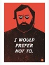
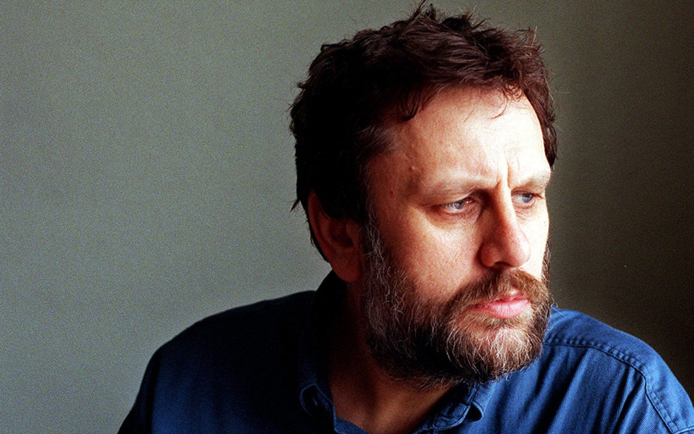
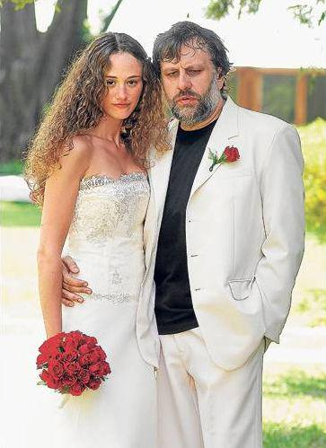
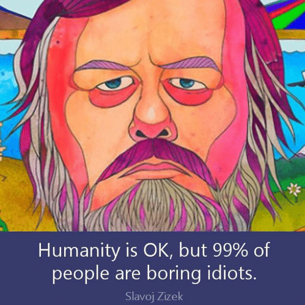

<!DOCTYPE html>
<html lang="en">
<head>
    <meta charset="UTF-8">
    <meta http-equiv="X-UA-Compatible" content="IE=edge">
    <meta name="viewport" content="width=device-width, initial-scale=1.0">
    <title>Slavoj Zizek</title>
    <link rel="stylesheet" href="zizek.css">
    <link rel="preconnect" href="https://fonts.gstatic.com">
    <link rel="stylesheet" href="https://cdn.jsdelivr.net/bxslider/4.2.12/jquery.bxslider.css">
    <link href="https://fonts.googleapis.com/css2?family=Lora:ital,wght@0,400;0,600;1,500&display=swap" rel="stylesheet">
</head>
<body>
   <header>
       

           

               
               <h1>Славой Жижек </h1>
           

           

            <ul>
                <li><a class="link" href="#biography">Кой е Славой?</a></li>
                <li><a class="link" href="#love">Любов</a></li>
                <li><a class="link" href="#interview">Идеи</a></li>
                <li><a class="link" href="#jokes">Шеги</a></li>
            </ul>
           

       

   </header>
    <main>
        

                

        

        <section class="biography" id="biography">
            

            <h1>Биография</h1>
            

            

            

                
            

            

                    
Славой Жижек е роден на 21-ви март 1949г. Той е словенски философ, изследовател
                    в катедрата по философия в Люблянския университет и международен директор на Института
                    за хуманитарни науки Бирбек. Освен това е световнопризнат стипендиант в 
                    университета Кюнг Хий в Сеул и световно изявен професор по немски език в Нюйоркския университет.
                    Основните теми на неговата философия са континенталната философия, психоанализата,
                    политическата теория, културологията, изкуствознанието, филмовата критика, макрсизмът, хегелианството
                    и теологията. Славой Жижек е автор на над 40 книги, които се простират от темите за философия,
                    психоанализа и социология до филмовата и политическата критика.
                     

            

        </section>
            <section class="love" id="love">
                

                    <h1>Любов</h1>
                

                

                    
                    

                    

                    
                    
"Любовта е бедствие.Тя е ужасна болест. 
                     Любовта съсипва живота. 
                     Но аз съм много нещастен, когато не съм влюбен..."

                   
                   
                    

                    

                        
 " Ако имаш причина да обичаш някого 
                            означава, че не го обичаш"

                        

                    

                    

                        
"Единствената мярка за истинската любов  
                           е възможността да обиждаш другия! 

                    

                    

                    

                        
                   
                    

                        
 Славой Жижек е бил женен 4 пъти. Третата му съпруга е аржентинския модел
                          Аналия Хуни. Вмомента е женен за словенския журналист и философ - Йела Кречич.
                         

                    

                    
                
             
            </section>
            <section class= "interview" id="interview">
                
                    <h1>Интервюта и идеи</h1>
                    
   
                       
<iframe width="520" height="340" src="https://www.youtube.com/embed/Zm5tpQp6sT4" title="YouTube video player" frameborder="0" allow="accelerometer; autoplay; clipboard-write; encrypted-media; gyroscope; picture-in-picture" allowfullscreen></iframe>

                       
<iframe width="520" height="340" src="https://www.youtube.com/embed/bwDrHqNZ9lo" title="YouTube video player" frameborder="0" allow="accelerometer; autoplay; clipboard-write; encrypted-media; gyroscope; picture-in-picture" allowfullscreen></iframe>

                       
<iframe width="520" height="340" src="https://www.youtube.com/embed/XS_Lzo4S8lA" title="YouTube video player" frameborder="0" allow="accelerometer; autoplay; clipboard-write; encrypted-media; gyroscope; picture-in-picture" allowfullscreen></iframe>

                       
<iframe width="520" height="340" src="https://www.youtube.com/embed/U88jj6PSD7w" title="YouTube video player" frameborder="0" allow="accelerometer; autoplay; clipboard-write; encrypted-media; gyroscope; picture-in-picture" allowfullscreen></iframe>

                       
<iframe width="520" height="340" src="https://www.youtube.com/embed/3rvrDyYOQp0" title="YouTube video player" frameborder="0" allow="accelerometer; autoplay; clipboard-write; encrypted-media; gyroscope; picture-in-picture" allowfullscreen></iframe>

                    

            </section>
            <section class="jokes" id="jokes">
                
                

                    

                    <h1>Шеги</h1>
                   
"Ти не мразиш понеделниците, ти мразиш капитализма!"
                    
  
                    

               
                    

                        
                    

                    
                        

                        
 Една шега от ранните 1960 години приятно синтезира парадокса на предразсъдъците. 
                        След като Юрий Гагарин - посетил космоса за пръв път в историята на човечеството, той бил приет от Никита Крушчов, 
                        генералният секретар на комунистическата партия. Космонавтът споделил поверително :  
                        "Знаеш ли, началник, там горе - в небето, видях рая с Бог и ангелите - Християнството е вярно!" 
                        Хрушчов му прошепнал обратно :" Знам, знам, но пази тишина и не казвай на никого!".  
                        Следващата седмица Гагарин посетил Ватикана и бил приет от Папата, на когото признал : 
                        "Знаеш ли, свещени Отче, бях горе в небето и не видях нито Бог, нито ангели..."  
                        "Знам, знам... " - прекъснал го Папата " но пази тишина и не казвай на никого!"
                         

                         

                         

                              <button id="jokeButton">
Бих предпочел още една "Не"шега...
</button>
                         

                    

                        

                            <h1>Коментари:</h1>
                        

                        
  
                         

                        

                            
                        
  
                             
                    

            
            </section>
            <section class="footer">
              
 Slavoj Zizek 2021. ALL RIGHTS RESERVED
 
               
And So on... And so on... And so on...

            </section>
        
    

       
 </img>

        

        

    

    </main>
      
    
    
    
    
    
</body>
</html>